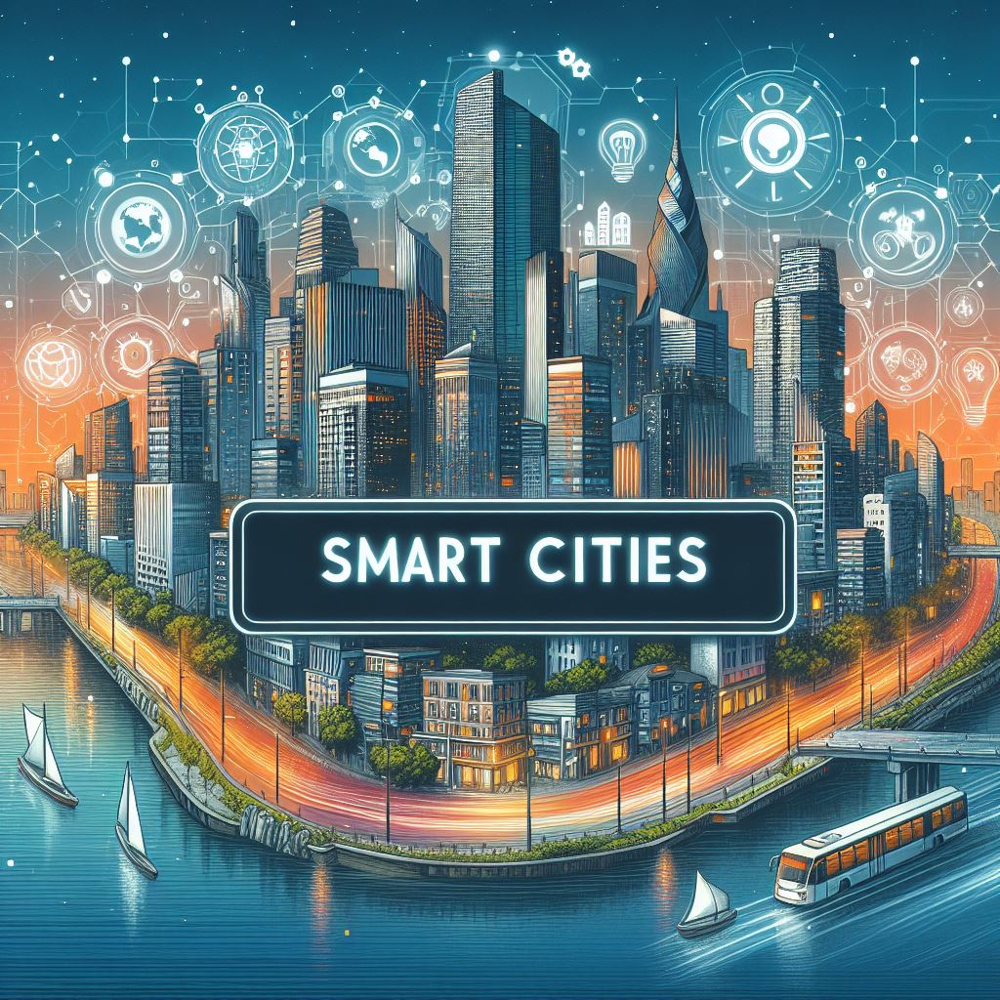

# TFG - OPEN DATA IN SMART CITIES

El proyecto consiste en el desarrollo de una aplicación que permita al usuario una experiencia más cómoda en una ciudad, mediante el tratamiento de datos abiertos incorporando FIWARE. Se ofrece al usuario diversas funcionalidades con los datos obtenidos de su ciudad (aforos, localizaciones, teléfonos, horarios...), como la consulta, registro de datos periódicamente, entre otras funcionalidades.

## Enlaces de interés
 ||  ||  || 

## Contacto
No dudes en contactar conmigo a través del siguiente correo: ada1009@alu.ubu.es

